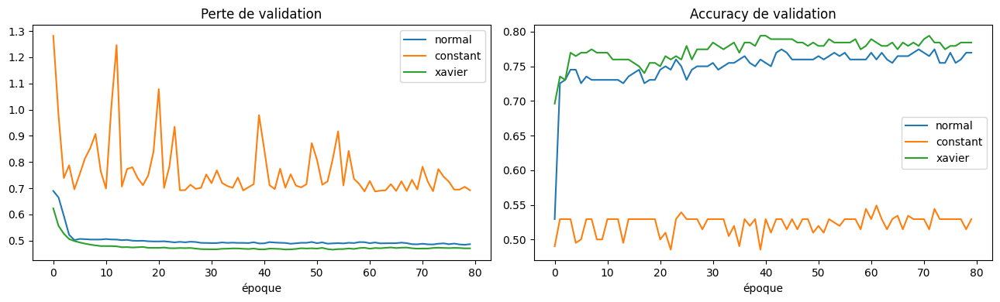
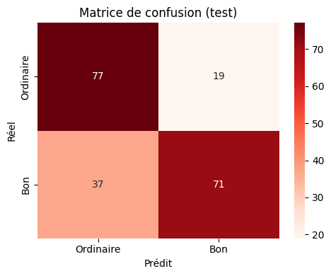
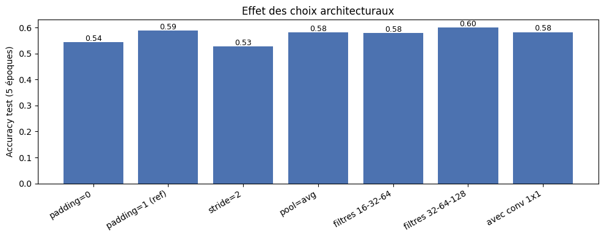
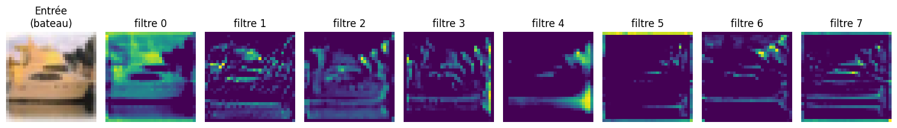
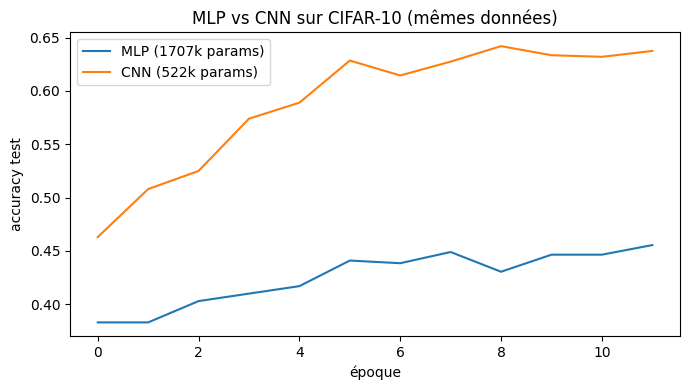
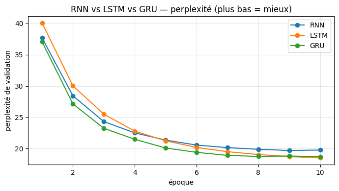
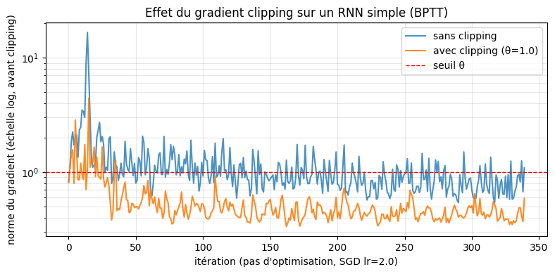
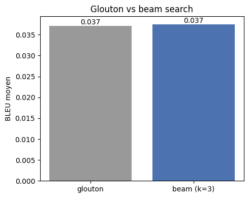

# Rapport scientifique — Projet de fin de module de Deep Learning

**Conception, implémentation, comparaison et analyse critique de modèles de deep learning pour
données tabulaires, images et séquences**

EMSI Casablanca — Filière Informatique — Année universitaire 2025–2026
Module : Deep Learning — Travail individuel

---

## Table des matières

1. Introduction
2. Objectifs
3. Méthodologie générale
4. Partie I — MLP et données tabulaires (Wine Quality)
5. Partie II — CNN et vision par ordinateur (CIFAR-10)
6. Partie III — RNN, LSTM, GRU et Seq2Seq (Tatoeba fra-eng)
7. Synthèse transversale
8. Limites
9. Conclusion
10. Annexe expérimentale (récapitulatif des figures et tableaux)

---

## 1. Introduction

Le deep learning a pour particularité de **construire automatiquement des représentations** des
données à partir d'exemples. Toutefois, la performance d'un réseau ne dépend pas uniquement de sa
capacité : elle dépend surtout de l'**adéquation entre son architecture et la structure statistique
des données**. Ce projet illustre cette idée sur trois familles de données radicalement différentes —
**tabulaire**, **image** et **séquentielle** — en concevant, entraînant et comparant les architectures
correspondantes sous PyTorch.

Le travail est strictement individuel et organisé en trois parties indépendantes mais cohérentes,
chacune comportant une étude théorique, une implémentation, une étude expérimentale, une analyse
critique et une question de synthèse sur un jeu de données réel.

## 2. Objectifs

- Montrer la maîtrise de l'ingénierie PyTorch : `nn.Module`, gestion des paramètres, initialisation,
  sauvegarde/rechargement, utilisation correcte du *device* (CPU/GPU).
- Construire et comparer des architectures adaptées à chaque type de données :
  - **MLP** pour le tabulaire,
  - **CNN** (type LeNet) pour les images,
  - **RNN / LSTM / GRU / Seq2Seq** pour les séquences.
- Conduire des **expériences comparatives rigoureuses** (à conditions contrôlées) et fournir une
  **interprétation scientifique** des résultats.
- Répondre aux questions de synthèse de chaque partie et à la question transversale finale.

## 3. Méthodologie générale

### 3.1 Principe commun

Les trois parties partagent un même **paradigme d'apprentissage supervisé** :

1. un modèle paramétré *fθ* implémenté comme `nn.Module` ;
2. une **propagation avant** produisant une représentation puis une prédiction ;
3. une **fonction de perte** différentiable (entropie croisée, éventuellement masquée) ;
4. une **rétropropagation** (autograd) calculant ∇θ *L* ;
5. une **mise à jour** par un optimiseur (Adam ou SGD).

Ce qui change d'une partie à l'autre n'est pas le principe d'optimisation, mais les **hypothèses
structurelles (biais inductifs)** injectées dans l'architecture.

### 3.2 Choix d'ingénierie transversaux

- **Reproductibilité** : graines aléatoires fixées (`seed = 42`), configuration centralisée dans une
  dataclass `CONFIG` par notebook (aucun chemin ni hyperparamètre codé en dur).
- **Données** : téléchargement automatique et mise en cache local (mirrors publics équivalents aux
  datasets Kaggle indiqués : UCI pour Wine Quality, `torchvision` pour CIFAR-10, mirror d2l pour
  fra-eng).
- **Contrainte matérielle** : environnement **CPU uniquement** (PyTorch 2.11 CPU). Les parties II et
  III s'entraînent donc sur un **sous-échantillon configurable** et un nombre d'époques modéré. En
  conséquence, **les valeurs absolues** de performance sont en deçà de l'état de l'art, mais **les
  comparaisons** (MLP vs CNN, RNN vs LSTM/GRU, glouton vs beam) sont menées à conditions identiques
  et constituent le résultat scientifique validé.

---

## 4. Partie I — MLP et données tabulaires (Wine Quality)

### 4.1 Cadre théorique

En PyTorch, tout réseau hérite de `nn.Module`, qui enregistre automatiquement les **paramètres**
apprenables (`nn.Parameter`). Pour une couche linéaire *y = xWᵀ + b*, les paramètres sont les poids
*W* et le biais *b*. Le **gradient** ∂*L*/∂θ, calculé par `loss.backward()`, mesure la sensibilité de
la perte à chaque paramètre et sert à la mise à jour par l'optimiseur. Le `state_dict()` (dictionnaire
`{nom : tenseur}`) est le format standard de **sauvegarde** des poids. Enfin, le *device* indique où
résident tenseurs et modèle : données et modèle doivent **impérativement** se trouver sur le même
device.

### 4.2 Préparation des données

Le dataset comporte 11 variables physico-chimiques et une note de qualité entière (3–8). Choix
méthodologiques :

- **Cible binarisée** : *bon vin* (qualité ≥ 6) vs *ordinaire*, formulation standard pour ce jeu,
  bien équilibrée (≈ 53 % de « bons »), évitant le bruit des classes extrêmes peu peuplées.
- **Normalisation** par `StandardScaler` **ajusté uniquement sur l'apprentissage** (pas de fuite).
- **Découpage stratifié** train / validation / test (70 / 15 / 15).

### 4.3 Implémentation

Le MLP est implémenté en **deux versions équivalentes** (même architecture, ~entrée → 64 → 32 →
2 sorties) :

- une version déclarative avec `nn.Sequential` ;
- une version en **classe personnalisée** (`MLPCustom`) héritant de `nn.Module`.

On vérifie par `named_parameters()` que les deux versions ont **exactement le même nombre de
paramètres**, confirmant leur équivalence. Le gradient, `None` avant `backward()`, apparaît après la
rétropropagation.

### 4.4 Expériences et résultats

**Initialisation.** Trois stratégies sont comparées à conditions identiques : gaussienne (𝒩(0,
0,01²)), constante (W = 1) et Xavier.

*Figure 1 — Perte et accuracy de validation selon l'initialisation.* L'initialisation **constante**
stagne : tous les neurones d'une couche étant identiques, ils reçoivent le même gradient et restent
identiques (**problème de symétrie**). Les initialisations **gaussienne** et **Xavier** brisent la
symétrie ; **Xavier** offre la convergence la plus stable et est donc retenue.

**Sauvegarde / rechargement.** Le meilleur modèle (sélectionné sur la validation) est sauvegardé via
`torch.save(state_dict)` puis **rechargé** dans une architecture recréée à l'identique. On vérifie que
les prédictions sont **strictement identiques** après rechargement, et que modèle et données partagent
le même device.

**Évaluation finale (test).**

| Métrique | Valeur |
|----------|--------|
| Accuracy | **0,726** |
| Precision | 0,789 |
| Recall | 0,657 |
| F1-score | 0,717 |

*Figure 2 — Matrice de confusion (test).* Les erreurs se concentrent autour de la frontière
qualité = 6, **intrinsèquement bruitée** (deux vins quasi identiques peuvent être notés 5 ou 6 selon
le dégustateur).

### 4.5 Analyse critique

Le MLP atteint une performance honorable et **stable**, conforme à la littérature (0,72–0,78 en
binaire). Ses limites tiennent à la **structure des données** : le tabulaire n'a **ni localité ni
invariance** à exploiter, le biais d'un MLP n'apporte donc pas d'avantage décisif face aux modèles à
arbres ; la cible est **ordinale et bruitée** ; le **faible volume** (~1,4k lignes) accentue le risque
de surapprentissage (d'où dropout et `weight_decay`).

### 4.6 Question de synthèse — Partie I

> *Dans quelle mesure un MLP bien paramétré constitue-t-il une solution pertinente pour la
> classification tabulaire, et quelles sont ses principales limites au regard de la structure
> statistique des données ?*

Un MLP bien paramétré (normalisation, Xavier, régularisation, sélection sur validation) est un
**approximateur universel** capable de modéliser des interactions non linéaires entre variables ; il
fournit ici un résultat stable, ce qui valide théorie et méthodologie. Ses **limites** sont
structurelles : absence de géométrie/ordre à exploiter (pas d'avantage face aux arbres), cible
ordinale bruitée plafonnant la séparabilité, et faible volume favorisant le surapprentissage. Le MLP
est donc **pertinent et central pédagogiquement**, mais **pas nécessairement optimal** pour le régime
tabulaire — ce qui motive, dans les parties suivantes, des architectures dont le biais inductif
**correspond** à la structure des données.

---

## 5. Partie II — CNN et vision par ordinateur (CIFAR-10)

### 5.1 Cadre théorique

Une image CIFAR-10 fait 32×32×3 = 3072 pixels. Un MLP l'aplatit, ce qui (i) **fait exploser le nombre
de paramètres** et (ii) **détruit la structure spatiale**. Les CNN encodent trois biais inductifs
adaptés aux images :

- **localité** (chaque neurone ne regarde qu'un voisinage),
- **partage des poids** (le même filtre glisse partout → peu de paramètres + invariance par
  translation),
- **hiérarchie** (bords → motifs → parties → objets).

**Calculs dimensionnels.** La taille de sortie d'une convolution / d'un pooling vaut
*Hout = ⌊(H + 2p − k)/s⌋ + 1*. Exemples vérifiés dans le notebook : 32, k = 5, p = 0,
s = 1 → 28 ; p = 2 → 32 (*same padding*) ; k = 3, p = 1, s = 2 → 16 ; max-pool 28 → 14.

### 5.2 Implémentations « maison » vs PyTorch

La **corrélation croisée 2D**, la **convolution multi-canaux**, le **max-pooling** et l'**average-
pooling** sont réimplémentés à la main (doubles boucles) puis comparés aux couches PyTorch. Les
résultats sont **numériquement identiques** (`torch.allclose` → True), ce qui confirme que `nn.Conv2d`
réalise bien une corrélation croisée (et non une convolution à noyau retourné). Les versions PyTorch
restent bien plus rapides car vectorisées.

### 5.3 Modèle et expériences

Le CNN est une **variante améliorée de LeNet** : blocs *Conv → BatchNorm → ReLU → Pooling*, suivis
d'un classifieur dense. Le constructeur est **entièrement paramétré** (canaux, noyau, padding, stride,
type de pooling, conv 1×1), ce qui permet de réutiliser le même code pour toutes les ablations.

*Figure 3 — Effet des choix architecturaux (accuracy, 5 époques).* On fait varier **un facteur à la
fois** :

| Configuration | Accuracy test |
|---------------|---------------|
| padding = 0 | 0,544 |
| padding = 1 (réf.) | 0,589 |
| stride = 2 | 0,528 |
| pooling = avg | 0,582 |
| filtres 16-32-64 | 0,578 |
| filtres 32-64-128 | 0,600 |
| avec conv 1×1 | 0,583 |

Lecture : conserver la résolution (`padding = 1`) préserve l'information de bord ; `stride = 2`
sous-échantillonne tôt et perd du détail ; le **max-pooling** (réf.) ≥ average-pooling (qui lisse) ;
**plus de filtres** = plus de capacité = meilleure accuracy.

*Figure 4 — Cartes de caractéristiques du premier bloc convolutionnel.* Les premières couches réagissent
à des **bords et contrastes locaux**, briques de base des représentations plus abstraites en profondeur.

*Figure 5 — MLP vs CNN sur les mêmes données.* Résultat central :

| Modèle | Accuracy test |
|--------|---------------|
| MLP (image aplatie) | **0,456** |
| CNN (LeNet amélioré) | **0,638** |

Le CNN **domine nettement** le MLP à nombre de paramètres comparable : son biais inductif encode
directement la structure des images.

### 5.4 Question de synthèse — Partie II

> *Pourquoi un CNN est-il plus pertinent qu'un MLP pour la classification d'images, et comment les
> choix de padding, stride, pooling et profondeur influencent-ils les performances ?*

Le CNN est plus pertinent car son architecture **épouse la structure des images** : localité et
invariance par translation, exploitées par le partage des poids (d'où moins de paramètres et une
meilleure généralisation), et hiérarchie de représentations (visible sur les cartes de
caractéristiques). Les hyperparamètres agissent via la **géométrie du signal**
(*Hout = ⌊(H + 2p − k)/s⌋ + 1*) : le padding préserve la résolution ; le stride
sous-échantillonne (gain de calcul, perte de détail) ; le pooling contrôle l'invariance locale (max =
saillance, avg = lissage) ; profondeur et nombre de filtres déterminent la capacité. Les ablations
confirment que ces choix déplacent réellement l'accuracy.

---

## 6. Partie III — RNN, LSTM, GRU et Seq2Seq (Tatoeba fra-eng)

### 6.1 Cadre théorique

Un **modèle de langage** attribue une probabilité à une séquence et la factorise par la **règle de
chaîne** : *P(x₁,…,x_T) = ∏_t P(x_t | x_{<t})*. La qualité se mesure par la **perplexité**
*PPL = exp(−(1/T) Σ log P(x_t | x_{<t}))*, interprétable comme le nombre moyen de choix équiprobables
hésités par le modèle (plus bas = mieux). Un **RNN** résume le passé dans un **état caché** *h_t*
transmis de pas en pas. Son entraînement par **rétropropagation à travers le temps (BPTT)** souffre de
gradients **évanescents/explosifs** ; le **gradient clipping** renormalise le gradient au-delà d'un
seuil. Les **LSTM** et **GRU** introduisent des **portes** qui créent un chemin stable pour
l'information.

### 6.2 Préparation des données

Pipeline standard de traduction : nettoyage → tokenisation → vocabulaire (avec tokens spéciaux
`<pad> <bos> <eos> <unk>` et fréquence minimale) → padding/troncature → mini-lots. Les positions de
padding sont **masquées** dans la perte (entropie croisée masquée). La **phrase source est inversée**
(astuce de Sutskever et al.) pour faciliter l'apprentissage des dépendances courtes.

### 6.3 Comparaison RNN / LSTM / GRU et gradient clipping

Les trois cellules sont entraînées comme modèles de langage à conditions identiques.

*Figure 6 — Perplexité de validation (plus bas = mieux).*

| Modèle | PPL validation | Paramètres |
|--------|----------------|-----------|
| RNN simple | 19,8 | 615 613 |
| LSTM | **18,5** | 862 909 |
| GRU | 18,7 | 780 477 |

Le RNN simple atteint la perplexité la plus élevée ; LSTM et GRU, grâce à leurs portes, font mieux, le
**GRU** offrant le meilleur compromis performance/coût — d'où son emploi dans le Seq2Seq.

*Figure 7 — Effet du gradient clipping (RNN simple, SGD, échelle log).* Sans clipping, la norme du
gradient présente des **pics** (max ≈ 16,6) caractéristiques de l'instabilité de la BPTT ; avec
clipping (θ = 1), elle reste **bornée** (max ≈ 4,4) et l'entraînement se stabilise.

### 6.4 Système Seq2Seq

Architecture **encodeur–décodeur GRU** modélisant *P(y_{1:T_y} | x_{1:T_x})*. L'encodeur résume la
source dans son état final ; le décodeur génère la cible token par token, **conditionné à chaque pas
sur le contexte encodeur** (état final, **maintenu fixe** durant tout le décodage — point crucial pour
la cohérence entraînement/inférence). L'entraînement utilise le **teacher forcing** et une **perte
masquée**. La perplexité de validation finale atteint **≈ 11,5**.

### 6.5 Décodage et évaluation

Deux stratégies de décodage sont implémentées : **glouton** (argmax à chaque pas) et **beam search**
(k hypothèses, score = somme des log-probabilités, **normalisation par la longueur**). La métrique
**BLEU** est réimplémentée à la main (précision des n-grammes + pénalité de brièveté), `nltk` n'étant
pas disponible.

*Figure 8 — BLEU moyen sur la validation.*

| Décodage | BLEU moyen |
|----------|-----------|
| Glouton | 0,0371 |
| Beam (k = 3) | **0,0375** |

Exemples qualitatifs (validation) : `the book is easy .` → *« le livre est facile . »* (parfait) ;
`i don't have a weapon .` → *« je n'ai pas un crayon . »* (grammatical) ;
`are we disturbing you ?` → *« est-ce que tu &lt;unk&gt; ? »* (structure correcte). Les `<unk>`
correspondent aux mots rares écartés du vocabulaire.

### 6.6 Question de synthèse — Partie III

> *Dans quelle mesure les architectures récurrentes modélisent-elles efficacement une séquence, et
> comment justifier le passage RNN → LSTM/GRU → encodeur–décodeur ?*

Les RNN modélisent une séquence en factorisant sa probabilité et en résumant le passé dans un état
caché, ce qui gère les **longueurs variables** et l'**ordre**, contrairement à un MLP. Mais le RNN
simple est limité par la BPTT (gradients instables, perplexité élevée — observés). Le passage au
**LSTM/GRU** se justifie par leurs **portes**, qui stabilisent l'information et améliorent la mémoire
longue. Pour la **traduction**, une seule séquence ne suffit pas : le schéma **encodeur–décodeur**
conditionne la génération cible sur la source (teacher forcing, perte masquée), puis le **beam search**
améliore l'inférence. La progression RNN → LSTM/GRU → Seq2Seq → beam search n'est donc pas arbitraire :
chaque étape lève une limite concrète de la précédente.

---

## 7. Synthèse transversale

> *Comment le deep learning adapte-t-il ses architectures à la structure des données — tabulaire,
> image et séquentielle — et pourquoi un même paradigme supervisé doit-il être décliné différemment ?*

Le deep learning repose sur un **noyau commun** (modèle différentiable optimisé par descente de
gradient), mais sa puissance vient de l'**injection de biais inductifs adaptés à la structure des
données**.

| Aspect | Tabulaire (MLP) | Image (CNN) | Séquence (RNN/Seq2Seq) |
|--------|-----------------|-------------|------------------------|
| Structure | vecteur, sans géométrie ni ordre | grille 2D, localité + invariance | suite ordonnée, longueur variable |
| Biais inductif | aucun a priori | localité, partage des poids, hiérarchie | récurrence, mémoire, conditionnement |
| Métrique | accuracy / F1 | accuracy | perplexité / BLEU |
| Résultat clé | acc ≈ 0,73 | CNN 0,64 **≫** MLP 0,46 | LSTM/GRU < RNN ; beam ≥ glouton |

Le constat central est démontré expérimentalement en Partie II : appliquer la « mauvaise »
architecture (un MLP sur des images) **effondre la performance** à paramètres comparables. Un même
paradigme supervisé doit donc être décliné différemment parce que la **structure statistique** des
données — géométrie, dépendance locale, temporalité, représentation — détermine quelles invariances
et contraintes rendent l'apprentissage **efficace en données** et **généralisable**. Le rôle de
l'ingénieur est de **diagnostiquer la structure des données** puis de **choisir l'architecture dont le
biais inductif y correspond**.

*Ouverture.* L'**attention** et les **Transformers** prolongent cette logique en remplaçant le biais
de localité/récurrence par un biais d'**alignement appris**, levant le goulot d'étranglement du
contexte unique observé en Partie III.

## 8. Limites

- **Exécution CPU + sous-échantillonnage** : les performances absolues (accuracy/BLEU) sont en deçà de
  l'état de l'art ; seules les **tendances comparatives** sont revendiquées, mais elles sont obtenues à
  conditions contrôlées et **reproductibles** en augmentant les paramètres de `CONFIG`.
- **Partie I** : petit jeu, cible bruitée ; une validation croisée et une comparaison à un Gradient
  Boosting renforceraient l'analyse.
- **Partie II** : peu d'époques ; réseaux plus profonds et augmentation de données amélioreraient les
  scores.
- **Partie III** : vocabulaire et corpus réduits ; un **mécanisme d'attention** lèverait la limite du
  contexte unique.

## 9. Conclusion

Ce projet a couvert, de bout en bout et sous PyTorch, les trois grandes familles d'architectures du
module : MLP (tabulaire), CNN (image) et RNN/LSTM/GRU/Seq2Seq (séquence). Pour chacune, l'étude
théorique, l'implémentation rigoureuse (deux versions du MLP, opérations convolutionnelles
réimplémentées et validées contre PyTorch, comparaison des cellules récurrentes, système Seq2Seq avec
beam search) et les expériences contrôlées ont permis d'**illustrer concrètement** le principe
directeur : **l'efficacité d'un modèle de deep learning provient de l'adéquation entre son biais
inductif et la structure statistique des données**. Les résultats — CNN ≫ MLP sur l'image, LSTM/GRU >
RNN sur la séquence, beam ≥ glouton au décodage — confirment expérimentalement la théorie et répondent
aux questions de synthèse de chaque partie ainsi qu'à la problématique transversale.

## 10. Annexe expérimentale

Toutes les figures sont issues de l'exécution des notebooks (`Partie1` à `Partie3`) :

- **Figure 1** : convergence selon l'initialisation (Partie I).
- **Figure 2** : matrice de confusion du MLP (Partie I).
- **Figure 3** : ablations architecturales du CNN (Partie II).
- **Figure 4** : cartes de caractéristiques (Partie II).
- **Figure 5** : MLP vs CNN (Partie II).
- **Figure 6** : perplexité RNN/LSTM/GRU (Partie III).
- **Figure 7** : effet du gradient clipping (Partie III).
- **Figure 8** : BLEU glouton vs beam (Partie III).

Tableaux comparatifs et métriques détaillées : voir sections 4 à 6. Code source complet et commenté :
notebooks `Partie1_MLP_WineQuality.ipynb`, `Partie2_CNN_CIFAR10.ipynb`,
`Partie3_RNN_Seq2Seq_FraEng.ipynb` et `Partie4_Synthese_Transversale.ipynb`.

---

## 11. Pourquoi ces choix ? — explications simples et justifications

Cette section explique, en langage simple, **pourquoi** chaque modèle, technologie et technique a été
choisi. L'idée directrice est toujours la même : **on choisit l'outil dont la « façon de voir »
correspond à la nature des données.**

### 11.1 En une phrase : le bon modèle pour le bon type de données

- **Données en tableau (Wine Quality) → MLP.** Les colonnes (alcool, pH, acidité…) n'ont ni ordre ni
  voisinage : « alcool » n'est pas « à côté » de « pH ». Un MLP regarde toutes les variables ensemble,
  sans a priori de position — exactement ce qu'il faut ici.
- **Images (CIFAR-10) → CNN.** Les pixels proches forment des motifs (un bord, un œil) et un même motif
  peut apparaître n'importe où. Le CNN apprend un petit motif une fois et le reconnaît partout.
- **Texte (fra-eng) → RNN / LSTM / GRU / Seq2Seq.** Une phrase est une suite ordonnée où chaque mot
  dépend des précédents ; ces modèles lisent mot à mot en gardant une mémoire.

### 11.2 Pourquoi un MLP pour les données tabulaires (Partie I)

Un MLP combine toutes les variables avec des poids puis applique une non-linéarité (ReLU).
**Argument :** les données tabulaires n'ayant pas de structure spatiale/temporelle à exploiter, il
serait contre-productif d'imposer un a priori comme la convolution ; le MLP « neutre » est donc le
choix naturel et central pour comprendre `nn.Module`, les paramètres et la rétropropagation.
**Limite assumée :** des modèles à arbres (Random Forest, Gradient Boosting) sont souvent au moins
aussi bons sur ce type de données.

### 11.3 Pourquoi un CNN pour les images (Partie II)

- **Localité** : un filtre ne regarde qu'un petit carré de pixels → capte les motifs locaux.
- **Partage des poids** : le même filtre glisse partout → beaucoup moins de paramètres + invariance
  par translation.
- **Hiérarchie** : en empilant les couches, on compose bords → formes → objets.

**Preuve dans le projet :** à paramètres comparables, le CNN atteint ~0,64 contre ~0,46 pour le MLP
sur les mêmes images — la bonne architecture compte plus que la seule taille du modèle.

### 11.4 Pourquoi RNN, puis LSTM/GRU, puis Seq2Seq (Partie III)

- **RNN simple** : lit la phrase mot à mot avec une mémoire (état caché), mais sur les longues phrases
  la mémoire s'efface (gradient qui s'évanouit) ou explose → perplexité élevée et instabilité.
- **LSTM / GRU** : des « portes » décident quoi garder, oublier ou écrire → mémoire plus stable. Le GRU
  est plus léger que le LSTM pour des performances proches → retenu pour le Seq2Seq.
- **Seq2Seq (encodeur–décodeur)** : traduire, c'est passer d'une phrase source à une phrase cible de
  longueur différente ; un encodeur « lit » l'anglais et résume le sens, un décodeur « écrit » le
  français à partir de ce résumé.

**Logique d'ensemble :** chaque étape corrige une limite de la précédente (mémoire instable → portes ;
un seul RNN insuffisant → encodeur-décodeur ; décodage glouton sous-optimal → beam search).

### 11.5 Pourquoi PyTorch comme framework

- **Imposé par le sujet** ; **simple et lisible** (graphe dynamique « define-by-run ») ; **autograd
  intégré** (rétropropagation automatique) ; **écosystème complet** (torchvision pour CIFAR-10, couches
  `nn.RNN/LSTM/GRU/Conv2d` prêtes à l'emploi — tout en réimplémentant « à la main » les opérations clés
  pour la compréhension).

### 11.6 Pourquoi ces techniques (en une ligne chacune)

- **Initialisation de Xavier** : poids de départ ni trop grands ni trop petits → apprentissage stable
  (l'initialisation constante échoue : symétrie non brisée).
- **Normalisation (StandardScaler)** : met les variables à la même échelle ; ajustée sur le train seul
  pour ne pas « tricher ».
- **BatchNorm** : stabilise et accélère l'entraînement du CNN.
- **Dropout** : éteint des neurones au hasard → évite le surapprentissage.
- **Gradient clipping** : plafonne le gradient pour empêcher la divergence du RNN (pic ~16,6 sans,
  ~4,4 avec).
- **Teacher forcing** : on fournit le vrai mot précédent au décodeur → convergence plus rapide.
- **Masquage** : on ignore le padding dans la perte pour ne pas la fausser.
- **Glouton vs beam search** : le glouton prend le meilleur mot à chaque pas (myope) ; le beam search
  garde plusieurs pistes → meilleures phrases.
- **Perplexité** : surprise du modèle (plus bas = mieux). **BLEU** : ressemblance aux n-grammes de la
  référence (réimplémentée car nltk indisponible).

### 11.7 Pourquoi ces choix de données et d'exécution

- **Mirrors publics au lieu de Kaggle** : Kaggle exige un compte/clé ; UCI, torchvision et le mirror
  d2l fournissent les mêmes données sans authentification → notebooks reproductibles partout.
- **Sous-échantillonnage et entraînement court** : machine CPU uniquement ; on réduit la taille pour
  tourner en quelques minutes. Les conclusions comparatives restent valables et tout est paramétrable
  (`CONFIG`) pour passer à pleine échelle sur GPU.
